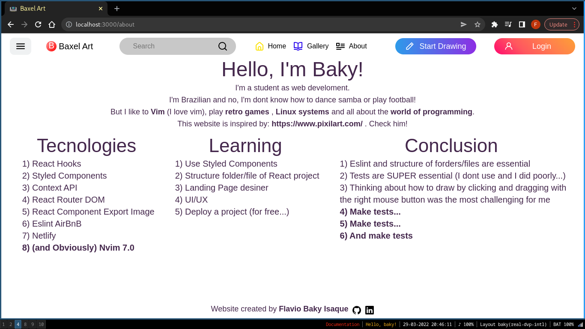
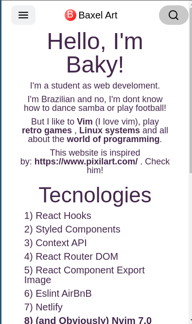

# Baxel Art

This is **my version** of a **Pixel Art Drawing**.
 
The layout and designer **(UI/UX)** is **based** on the website: https://www.pixilart.com/

The idea of this project is **based** in my **old project Pixel-Art**, developed in the ***[Trybe Development Course](https://www.betrybe.com/)***.

I'm **Baky**

and this is the...

**Baxel-Art**!

## Contents
 - [Overview](#overview)
   - [Live Version](#live-version)
   - [ScreenShots](#screenshots)
   - [Video](#video)
 - [Usage](#usage)
 - [Technologies](#technologies)
 - [Structure Project](#structure-project)
 - [About Creating of the Project](#about-creating-of-the-project)
   - [Objective](#objective)
   - [What I learned with this project](#what-i-learned-with-this-project)
     - [How to start a react project](#how-to-start-a-react-project)
     - [How to structure the folders and files](#how-to-structure-the-folders-and-files)
   - [My biggest defficulties](#my-biggest-difficulties)
     - [Responsivity](#responsivity)
     - [Click and Drag](#click-and-drag-(with-right-mouse-button))
 - [MAKE TESTS!](#make-tests!)
 - [Contributing](#contributing)
 - [Create by](#create-by)
## Overview
### Live Version
The live version of the **Baxel-Art** is **hosted** on https://stellar-fairy-4b227f.netlify.app/
### ScreenShots
**Home**


**Home with open menu**


**Gallery**


**Draw**


**About**



**Home Mobile**


**Home Mobile with open menu**


**Gallery Mobile**


**Draw Mobile**


**About Mobile**



### Video


## Usage
- Clone the repository:
```bash
git clone git@github.com:baky2708/Baxel-Art.git
```
- Install dependencies:
```bash
npm install
```
- Run project:
```bash
npm start
```
## Technologies
- [React Hooks](https://reactjs.org/docs/hooks-intro.html)
- [Styled Components](https://styled-components.com/)
- [Context API](https://reactjs.org/docs/context.html)
- [React Router DOM v5](https://v5.reactrouter.com/)
- [React Component Export Image](https://www.npmjs.com/package/react-component-export-image)
- [Eslint AirBnB](https://www.npmjs.com/package/eslint-config-airbnb)
- [Netlify](https://www.netlify.com/)
- **(and Obviously) [Nvim v0.7.0](https://github.com/neovim/neovim)**

## Structure Project
```bash
Baxel-Art/
|-- public/
|   |-- favicon.ico
|   |-- index.html
|-- src/ # main of project
|   |-- assets/
|       |-- avatar.svg
|       |-- sad.png
|       |-- gallery/ # images for gallery page
|           |-- gallery1.png
|           |-- gallery2.png
|           |-- gallery3.png
|       |-- icons/ # all icons of project
|           |-- icon-about.svg
|           |-- icon-book-blue.svg
|           |-- icon-erase-black.svg
|           |-- icon-find-black.svg
|           |-- icon-github.svg
|           |-- icon-house-yellow.svg
|           |-- icon-linkedin.svg
|           |-- icon-menu-black.svg
|           |-- icon-pencil-black.svg
|           |-- icon-pencil.svg
|           |-- icon-person.svg
|   |-- components/ # common components between pages
|       |-- Button/
|           |-- index.jsx
|           |-- styles.js
|       |-- Footer/
|           |-- index.jsx
|           |-- styles.js
|       |-- Header/
|           |-- LoginBtns/
|             |-- index.jsx
|             |-- styles.js
|           |-- Logo/
|             |-- index.jsx
|             |-- styles.js
|           |-- Menu/
|             |-- index.jsx
|             |-- styles.js
|             |-- NavBarMenu/
|                 |-- index.jsx
|                 |-- styles.js
|           |-- NavBar/
|             |-- index.jsx
|             |-- styles.js
|           |-- SearchBar/
|             |-- index.jsx
|             |-- styles.js
|           |-- index.jsx
|           |-- styles.js
|   |-- context/ # Context API
|       |-- Context.js
|       |-- Provider.js
|   |-- GlobalStyles/ # Styled Components Global
|       |-- index.jsx
|       |-- ResetCss.jsx
|   |-- pages/
|       |-- About/ # about page
|           |-- index.jsx
|           |-- styles.js
|       |-- Draw/ # draw page
|           |-- Main/
|               |-- Board/ # board to draw
|                   |-- Pixel/
|                       |-- index.jsx
|                       |-- styles.js
|                   |-- index.jsx
|                   |-- styles.js
|               |-- BoardMenu/ # options of board
|                   |-- ButtonExport/
|                       |-- index.jsx
|                       |-- styles.js
|                   |-- ColorsBlock
|                       |-- index.jsx
|                       |-- styles.js
|                   |-- InputSize
|                       |-- index.jsx
|                       |-- styles.js
|                   |-- index.jsx
|                   |-- styles.js
|               |-- BoardTools/ # tools for draw
|                   |-- ColorsSelected
|                       |-- index.jsx
|                       |-- styles.js
|                   |-- Erase
|                       |-- index.jsx
|                       |-- styles.js
|                   |-- Help
|                       |-- index.jsx
|                       |-- styles.js
|                   |-- Pencil
|                       |-- index.jsx
|                       |-- styles.js
|                   |-- index.jsx
|                   |-- styles.js
|               |-- index.jsx
|               |-- styles.js
|           |-- index.jsx
|           |-- styles.js
|       |-- Gallery/ # gallery page
|           |-- Main/
  |             |-- index.jsx
  |             |-- styles.js
|           |-- index.jsx
|           |-- styles.js
|       |-- Home/ # home page
|           |-- Main/
  |             |-- index.jsx
  |             |-- styles.js
|           |-- index.jsx
|           |-- styles.js
|       |-- Login/ # login page
|           |-- index.jsx
|           |-- styles.js
|   |-- routes/ # routes of project
|       |-- index.jsx
|   |-- App.jsx/
|   |-- index.jsx/
|-- .eslintrc.json # linter
|-- .gitignore
|-- package-lock.json
|-- package.json
|-- README.md
```

## About Creating of the Project

### Objective
1. - [x] An acceptable **lading page**
1. - [x] **Responsivity**
1. - [x] A **Side menu** toggle
1. - [x] Be able to **draw** with **clicking and dragging**
1. - [x] **Secound color** with **right** mouse **button**
1. - [x] **Change** the **size** of the board
1. - [x] **Reset** button
1. - [x] **Random colors** to choose
1. - [x] **Key Maps** for tools and reset
1. - [x] **Download image**
1. - [ ] Build **Unit Tests** (I suffered from it, do tests...)

### What I learned with this project

- #### How to start a react project
To **start** my project, I used [CRA](https://create-react-app.dev/) (Create React App), I **cleaned** the folders and files and **installed the dependencies** like React Router DOM, Eslint...

After I needed to **configure** the **Eslint** with AirBnB style guide and now I was ready to start.

- #### How to structure the folders and files

In the beginning, **I didn't how to organize** and **structure** my folders and files.

Then I **found articles** like:
- https://reactjs.org/docs/faq-structure.html
- https://www.freecodecamp.org/news/a-better-way-to-structure-react-projects/
- https://www.robinwieruch.de/react-folder-structure/

These **articles** gave me an **idea** to **organize** the files and it was like this:

**Project**
```bash
|-- src/ # Main project
|   |-- assets/ # for all media of project like icons and images
|   |-- components/ # for common components between pages
|   |-- context/ # for Context API
|   |-- GlobalStyles/ # for common styles of the Styled Components between pages
|   |-- pages/ # all pages of project
|   |-- routes/ # to centralize the routes
|   |-- App.jsx
|   |-- index.jsx
```

For **pages**, a centralize the **main code** in a folder called `Main`:

```bash
|-- AnyPage/
|   |-- Main/
|       |-- ComponentOfMain/
|       |-- index.jsx
|       |-- styles.js
|   |-- index.jsx
|   |-- styles.js
```

For any **component**, I created a **folder** and inside the folder, a **`index.jsx`** for **main coding** and a **`styles.js` for css** (styled components):

```bash
|-- AnyComponent/
|   |-- index.jsx
|   |-- styles.js
```
Is this the **best way?**

**Of course NOT...** But I can **find me** during the coding and worked fine **for me**.

### My biggest difficulties
- #### Responsivity
I **appreciate** the **designers**...

After this project, I **understand** the difficult of **designers** to **centralize a f****** **button!!!** *(sorry for the rant).*

Realy, **I didin't** have much experience with **responsivity**, but after a **lot of sweat** *(and tears)*, I got an **acceptable** (and a little bit "bugable") layout.

Responsivity: CHECK!

- #### Click and Drag (with right mouse button)

When I got a **click and drag** with **left** mouse button for **draw** in board, **I was so happy!!! "This is so easy!!"**, I thought.

But I **was wrong**...

I spent a **lot of time** to **understand** how to the **right click work** in react and how I will make **everything work**.

A **lot time again**, I use the **functions to manager my states** and use a **main function to manager my functions!**

Is this the **best way?**

**Of course NOT...** But I fell **like a genius** *(deluded programmer)*!

Click and Drag: CHECK!

### MAKE TESTS!

For **each functionality** I make, I didn't know if my code was right.

**Why** you don't **make unit tests** for any functionality?

**Because I'm crazy!** *(nooob)*

**But now**, after **hurt me** a lot with the **uncertainty of life**, at least I will know my **code** will be **fine** with **unit tests**.

The **next project** when I will do, the **Unit Tests will be there!**

Make test...

## Contributing

All contributions are **welcome!** Just open a **pull request** or **send** me a **message** in [linkedin](https://www.linkedin.com/in/flavio-baky-isaque/).

## Create by
Hello, I'm Flavio **Baky** Isaque, a Brazilian, **Web developer** student in **Trybe**.

I like to **Vim**, **retro games**, **Vim**, all about the **world of technology** and **Vim**. *(I love Vim...)* 

If you **liked** my **work**, **check** my others **projects** and my **linkedin**:

- https://github.com/baky2708/
- https://www.linkedin.com/in/flavio-baky-isaque/
