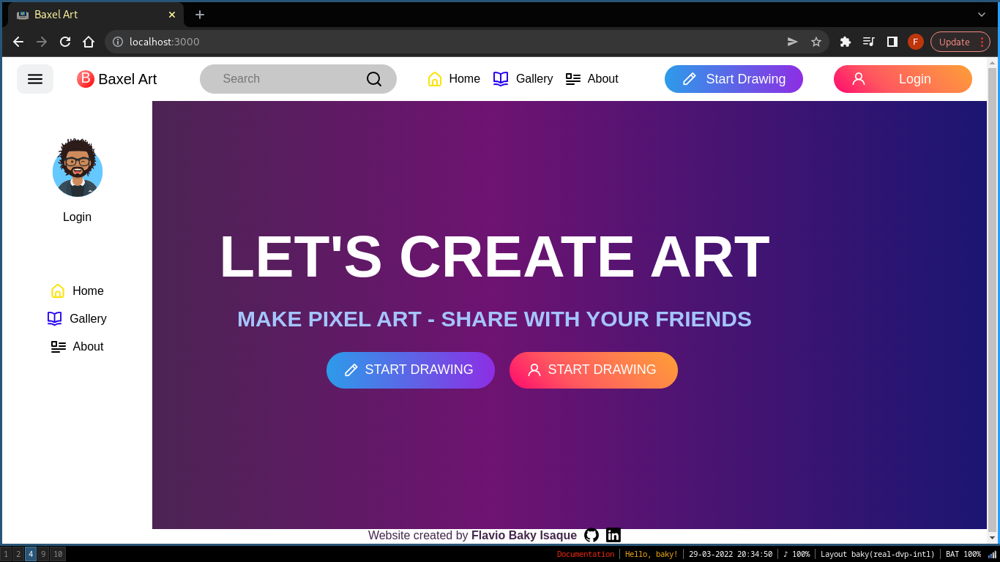
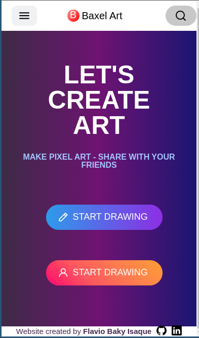
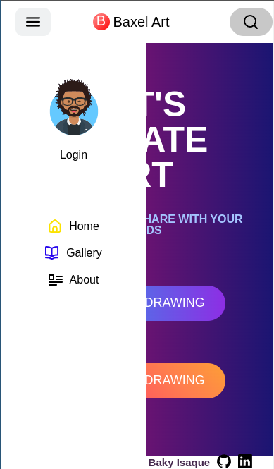
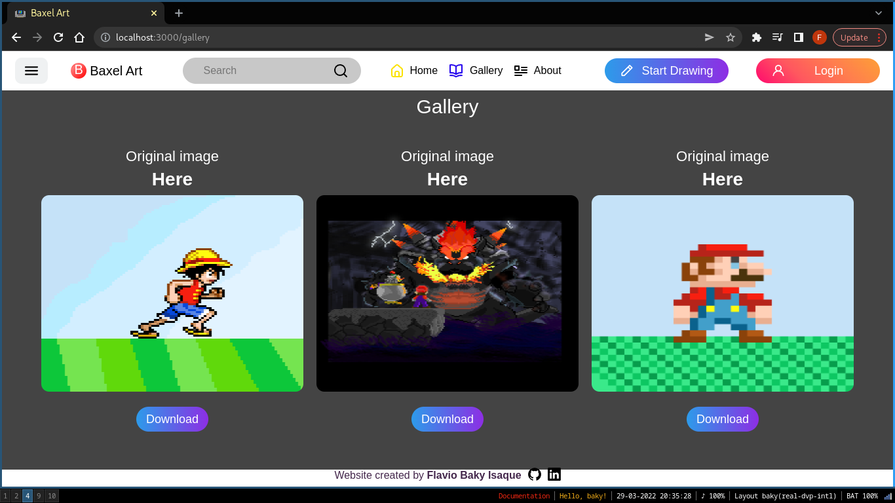
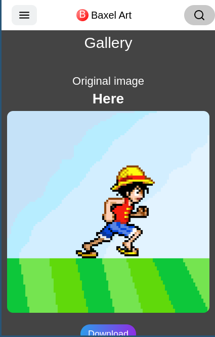
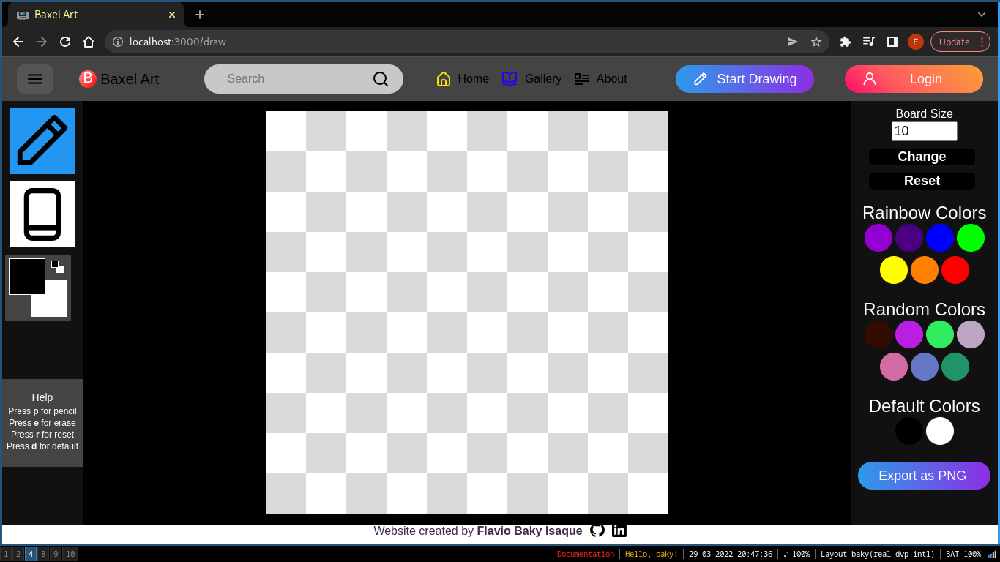
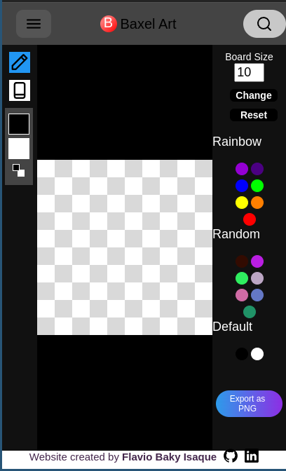
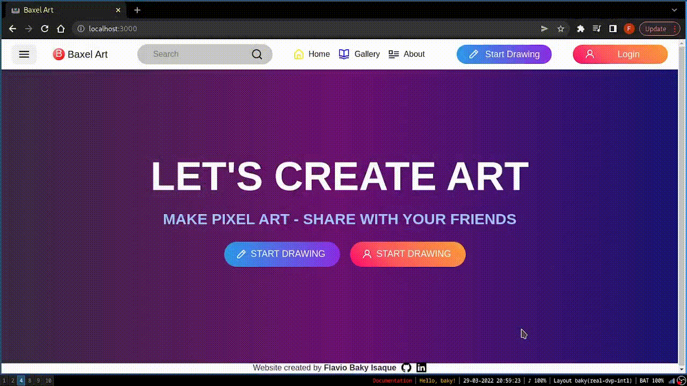

# Baxel Art

This is my version of a Pixel Art Drawing.
 
The layout and designer (UI/UX) is based on the website: https://www.pixilart.com/

The idea of this project is based in my old project Pixel-Art developed in the [Trybe](https://www.betrybe.com/) Development Course.

I'm Baky

and this is the...

**Baxel-Art**!

## Contents
## Overview
### ScreenShot
Home


Home with open menu



Home Mobile



Home with open menu


Home Mobile with open menu



Gallery



Gallery Mobile



Draw



Draw Mobile



### Video


## How to run
## Usage
## Technologies
## Live Version
## Structure Project
```bash
Baxel-Art/
|-- public/
|   |-- favicon.ico
|   |-- index.html
|-- src/ # main of project
|   |-- assets/
|       |-- avatar.svg
|       |-- sad.png
|       |-- gallery/ # images for gallery page
|           |-- gallery1.png
|           |-- gallery2.png
|           |-- gallery3.png
|       |-- icons/ # all icons of project
|           |-- icon-about.svg
|           |-- icon-book-blue.svg
|           |-- icon-erase-black.svg
|           |-- icon-find-black.svg
|           |-- icon-github.svg
|           |-- icon-house-yellow.svg
|           |-- icon-linkedin.svg
|           |-- icon-menu-black.svg
|           |-- icon-pencil-black.svg
|           |-- icon-pencil.svg
|           |-- icon-person.svg
|   |-- components/ # common components between pages
|       |-- Button/
|           |-- index.jsx
|           |-- styles.js
|       |-- Footer/
|           |-- index.jsx
|           |-- styles.js
|       |-- Header/
|           |-- LoginBtns/
|             |-- index.jsx
|             |-- styles.js
|           |-- Logo/
|             |-- index.jsx
|             |-- styles.js
|           |-- Menu/
|             |-- index.jsx
|             |-- styles.js
|             |-- NavBarMenu/
|                 |-- index.jsx
|                 |-- styles.js
|           |-- NavBar/
|             |-- index.jsx
|             |-- styles.js
|           |-- SearchBar/
|             |-- index.jsx
|             |-- styles.js
|           |-- index.jsx
|           |-- styles.js
|   |-- context/ # Context API
|       |-- Context.js
|       |-- Provider.js
|   |-- GlobalStyles/ # Styled Components Global
|       |-- index.jsx
|       |-- ResetCss.jsx
|   |-- pages/
|       |-- About/ # about page
|           |-- index.jsx
|           |-- styles.js
|       |-- Draw/ # draw page
|           |-- Main/
|               |-- Board/ # board to draw
|                   |-- Pixel/
|                       |-- index.jsx
|                       |-- styles.js
|                   |-- index.jsx
|                   |-- styles.js
|               |-- BoardMenu/ # options of board
|                   |-- ButtonExport/
|                       |-- index.jsx
|                       |-- styles.js
|                   |-- ColorsBlock
|                       |-- index.jsx
|                       |-- styles.js
|                   |-- InputSize
|                       |-- index.jsx
|                       |-- styles.js
|                   |-- index.jsx
|                   |-- styles.js
|               |-- BoardTools/ # tools for draw
|                   |-- ColorsSelected
|                       |-- index.jsx
|                       |-- styles.js
|                   |-- Erase
|                       |-- index.jsx
|                       |-- styles.js
|                   |-- Help
|                       |-- index.jsx
|                       |-- styles.js
|                   |-- Pencil
|                       |-- index.jsx
|                       |-- styles.js
|                   |-- index.jsx
|                   |-- styles.js
|               |-- index.jsx
|               |-- styles.js
|           |-- index.jsx
|           |-- styles.js
|       |-- Gallery/ # gallery page
|           |-- Main/
  |             |-- index.jsx
  |             |-- styles.js
|           |-- index.jsx
|           |-- styles.js
|       |-- Home/ # home page
|           |-- Main/
  |             |-- index.jsx
  |             |-- styles.js
|           |-- index.jsx
|           |-- styles.js
|       |-- Login/ # login page
|           |-- index.jsx
|           |-- styles.js
|   |-- routes/ # routes of project
|       |-- index.jsx
|   |-- App.jsx/
|   |-- index.jsx/
|-- .eslintrc.json # linter
|-- .gitignore
|-- package-lock.json
|-- package.json
|-- README.md
```

## Content of readme
### responsive
### draw
## Dependences
## Create by
## Contribuition

[live](https://stellar-fairy-4b227f.netlify.app)
